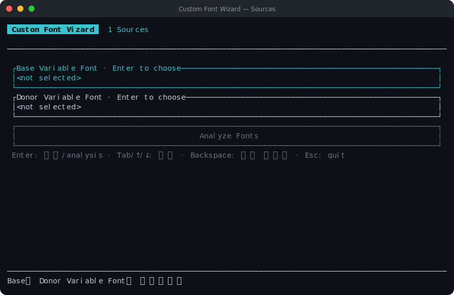
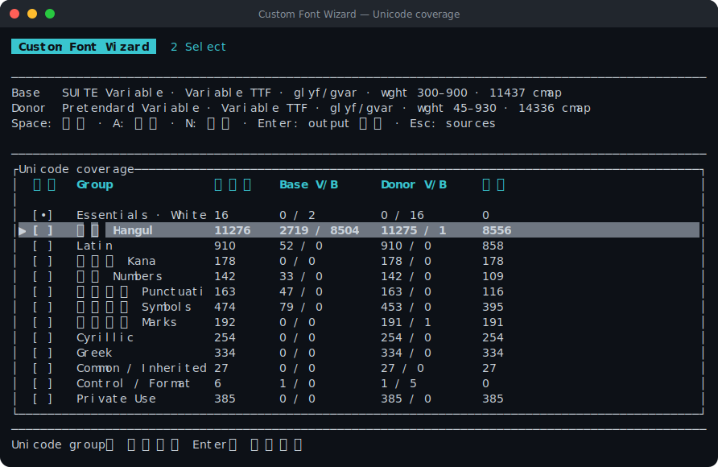

# Custom Font Wizard

두 Variable Font의 `cmap` 합집합을 분석하고, 선택한 Unicode group만으로 새 Variable Font를 만드는 Rust TUI입니다. Base에 정상 outline이 있으면 Base glyph를 유지하고, Base glyph가 누락됐거나 비어 있으면 Donor glyph로 채웁니다.

## 지원 범위

- Variable TTF(`glyf` + `gvar`) Base + Variable TTF Donor → Variable TTF output
- Variable OTF(`CFF2`) Base + Variable OTF Donor → Variable OTF output
- TTF/OTF 혼합, static font, WOFF/WOFF2는 지원하지 않습니다.
- Base와 Donor 모두 `wght` axis가 있어야 합니다. output에는 `wght` axis만 남고 다른 axis는 source default에 고정됩니다.

## 실행

Rust toolchain과 [uv](https://docs.astral.sh/uv/)가 필요합니다. Python은 `uv`가 `pyproject.toml`과 `uv.lock`에 맞춰 관리합니다.

### One-line installer

Rust toolchain과 `uv`가 설치되어 있어야 합니다. installer는 최신 GitHub Release source를 `~/.local/share/custom-font-wizard`에 설치하고 executable을 `~/.local/bin/custom-font-wizard`에 생성합니다.

`curl`:

```sh
curl -fsSL https://raw.githubusercontent.com/ziward-inc/custom-font-wizard/main/install.sh | sh
```

`wget`:

```sh
wget -qO- https://raw.githubusercontent.com/ziward-inc/custom-font-wizard/main/install.sh | sh
```

설치 후 `~/.local/bin`이 `PATH`에 포함되어 있으면 다음 command로 실행할 수 있습니다.

```sh
custom-font-wizard
```

### Source에서 실행

```sh
uv sync --dev
cargo run
```

처음 실행하면 Base와 Donor가 선택되지 않은 상태입니다. 각 field에서 `Enter`를 누르면 native file picker가 열립니다. macOS에서는 Finder 방식으로 font를 선택할 수 있습니다.

## 사용법

### 1. Font 선택 및 analysis

Base와 Donor field에서 각각 `Enter`를 누르면 native file picker가 열립니다. `.ttf`와 `.otf`만 표시되며 두 input은 같은 format이어야 합니다. 선택이 끝나면 `Analyze Fonts`로 이동해 `Enter`를 누릅니다.



선택을 취소해도 기존 선택은 유지됩니다. 선택된 font를 바꾸려면 해당 field에서 다시 `Enter`를 누르고, 선택을 완전히 지우려면 `Backspace` 또는 `Delete`를 누릅니다.

### 2. Unicode group 선택

analysis가 끝나면 Base와 Donor의 `cmap` 합집합으로 Unicode group이 자동 생성됩니다. `↑`/`↓`로 이동하고 `Space`로 output에 포함할 group을 선택합니다. `Essentials · Whitespace`는 정상적인 spacing을 위해 항상 포함됩니다.



compact table의 `Base V/B`와 `Donor V/B`는 각각 visible/blank glyph 수이며, `보완`은 Base의 blank 또는 missing glyph를 Donor에서 가져올 수 있는 수입니다. 선택이 끝나면 `Configure Font` button으로 이동해 `Enter`를 누릅니다.

### 3. Font 설정

family name 및 원하는 `wght` minimum/maximum을 입력한 뒤 `Continue to Output` button으로 이동해 `Enter`를 누릅니다. Base/Donor와 같은 family name도 사용할 수 있지만 OS font cache나 설치된 원본과의 충돌을 피하려면 고유한 family name을 권장합니다.

### 4. Output 설정

Output path는 base font와 같은 directory의 `[family name]-Variable.[ext]`로 자동 설정되며 field에서 직접 수정할 수 있습니다. 이전 phase에서 입력한 family name과 input format에 따른 `.ttf` 또는 `.otf` extension이 사용됩니다.

`Build Font` button으로 이동해 `Enter`를 누르면 별도의 `Save As` dialog 없이 지정된 Output path에 직접 build하며 Build progress 화면으로 이동합니다.

### 5. Build progress

Input validation, source analysis, glyph preparation, source variation merge 또는 static master 생성, Variable Font 생성, output 저장, output 검증 과정을 순서대로 표시합니다. 진행 중인 단계는 `[▶]`, 완료된 단계는 `[✓]`, 실패한 단계는 `[✗]`로 표시됩니다.

아래의 read-only Build log panel에는 variation merge 또는 master별 진행 상황과 필수 log가 표시됩니다. `↑`/`↓` 또는 `PageUp`/`PageDown`으로 이전 log를 확인할 수 있습니다. 실패하면 이 화면에 그대로 남으며 `Enter` 또는 `Esc`로 Output 설정에 돌아갈 수 있습니다. 성공하면 결과 화면으로 자동 이동합니다.

### 6. 결과

완료 화면에는 Base에서 유지한 수, Donor로 복구하거나 추가한 수, 사용할 수 없어 제외된 수와 사용한 weight sample이 표시됩니다.

### Key

- Source: `Tab`/`↑`/`↓` 이동, `Enter` font 선택 또는 analysis, `Backspace`/`Delete` 선택 지우기, `Esc` 종료
- Unicode group: `↑`/`↓` 이동, `Space` 선택, `A` 전체 선택, `N` 전체 해제, `Tab` button 이동, `Enter` button 실행, `Esc` 이전 단계
- Font setting / Output: `Tab`/`↑`/`↓` field/button 이동, `Ctrl+U` field 지우기, `Enter` 다음 field 또는 button 실행, `Esc` 이전 단계
- Build progress: `↑`/`↓`/`PageUp`/`PageDown` log 이동, 실패 후 `Enter`/`Esc` Output 설정 복귀
- Build 진행 중이 아닐 때 `Ctrl+C`로 종료할 수 있습니다.

80-column terminal에서는 compact coverage table을 사용하고, 넓은 terminal에서는 `Custom` 예상 codepoint 수도 함께 표시합니다.

## Coverage와 blank 판정

group은 고정 `unicode-range`가 아니라 `Base cmap ∪ Donor cmap`의 실제 codepoint를 Unicode script/category로 분류해 생성합니다. Hangul, Latin, Numbers, Punctuation, Symbols, Kana, Han, Marks와 그 밖의 발견된 script, Private Use 등이 필요한 경우에만 나타납니다.

각 group은 다음 정보를 표시합니다.

- 합집합 codepoint 수
- Base의 visible/blank 수
- Donor의 visible/blank 수
- Base의 blank 또는 missing을 Donor visible glyph로 보완할 수 있는 수

TTF glyph는 contour/component 유무로, OTF glyph는 계산된 outline bounds 유무로 blank를 판정합니다. Unicode whitespace는 outline이 없어도 정상 glyph로 취급하며 Base mapping을 우선하고, Base에 없으면 Donor mapping을 유지합니다. `.notdef`와 subset dependency는 자동으로 보존됩니다.

선택된 codepoint의 source 우선순위는 다음과 같습니다.

1. Base visible glyph
2. Base가 blank 또는 missing인 경우 Donor visible glyph
3. 두 font 모두 사용할 수 없으면 output에서 제외

## Weight range와 clamp

요청한 minimum/maximum은 output `wght` axis range가 됩니다. 요청 범위가 Base 범위 밖으로 나가면 해당 구간의 outline은 가장 가까운 Base 경계 값으로 clamp합니다. 예를 들어 Base가 `300–900`일 때 output을 `100–900`으로 만들면 `100–300`은 Base `300` outline과 같습니다.

TTF output range가 Base range 안에 있고 source에 별도 metric/axis variation table이 없으면 subset된 source `fvar/gvar`를 output axis에 맞게 normalize한 뒤 직접 결합합니다. 이 경로는 source outline interpolation을 보존하고 불필요한 intermediate `gvar` tuple을 만들지 않으며, output에 weight별 `fvar` named instance와 `STAT AxisValue`를 생성합니다.

요청 range가 Base range 밖으로 나가 clamp가 필요하거나 source variation table을 직접 결합할 수 없는 경우에는 요청 경계, Base default, 실제 구간 경계, 100 단위 weight, Base/Donor named instance의 weight에서 static master를 만든 뒤 `fontTools.varLib`으로 다시 구성합니다. 이 fallback에서는 sample 사이의 outline이 새 interpolation 결과이므로 source의 숨은 variation breakpoint와 완전히 같다고 보장하지 않습니다.

## Layout과 variation 처리

- TTF와 OTF 모두 subset dependency glyph와 Base/Donor의 `GSUB`, `GPOS`, `GDEF`를 merge합니다. OTF static master는 CID-keyed CFF를 포함해 dehinted name-keyed CFF로 normalize한 뒤 layout과 outline을 함께 merge하고 `fontTools.varLib`으로 CFF2 output을 구성합니다.
- Base와 Donor의 weight-dependent `GSUB FeatureVariations`와 `GPOS FeatureVariations`는 output `wght` condition에 맞춰 재구성합니다. `SingleSubst`, `MultipleSubst`, `AlternateSubst`, `LigatureSubst`, positioning, contextual lookup과 Extension lookup을 포함한 전체 alternate feature lookup graph를 보존합니다.
- GPOS의 `VariationIndex`가 참조하는 `GDEF VarStore` region과 `avar` kink를 breakpoint로 반영해 positioning 값을 재구성합니다. direct TTF path는 source `gvar/fvar`를 직접 결합한 뒤 이 GPOS/GDEF 결과만 교체하므로 outline variation 구조는 그대로 유지합니다.

## 현재 제약

- output은 안전한 subset/merge를 위해 dehinted font로 생성됩니다.

## 검증

```sh
cargo fmt --check
cargo test
cargo clippy --all-targets -- -D warnings
uv run ruff format worker tests --check
uv run ruff check worker tests
uv run ty check
uv run python -m unittest discover -s tests -v
```
